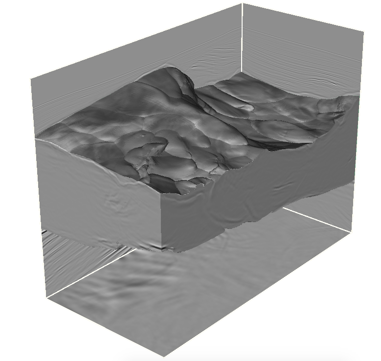
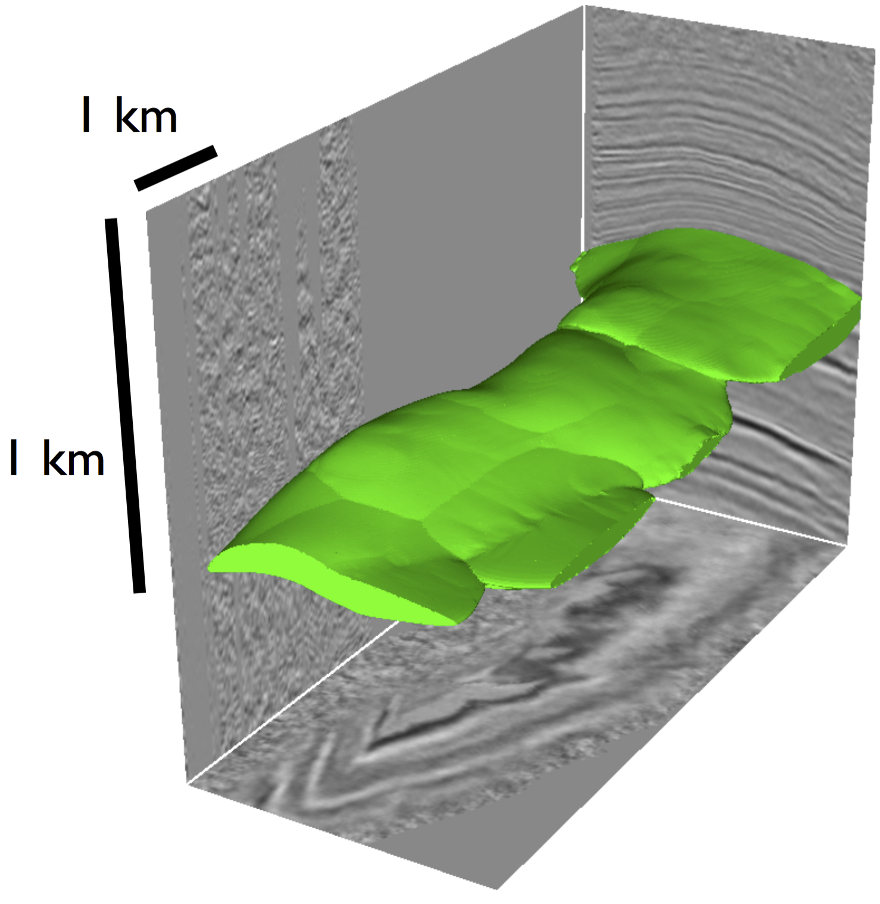

A 3D Interactive Image-Guided Paintbrush [](https://travis-ci.org/chrisengelsma/3d-painting)
----------------------------
  
 
Seismic interpretation is an important step when developing a model of the subsurface. In past decades, this process involved interpreting 2D seismic sections on paper with colored pencils. Over time, seismic surveys evolved to three dimensions and computational power allowed for processing on workstations. Interpreters then found it easier to interpret seismic horizons, or theboundaries between geologic layers, rather than geologic formations themselves. Unfortunately, horizons are tedious to assemble and may contain holes where the image is poor. It may be more efficient and useful to interpret volumes directly through 3D painting.

3D painting attempts to expedite the interpretation process by painting volumes with a digital 3D paintbrush. Multiple seismic slices are interpreted simultaneously as features within the image control the paintbrush's shape and orientation. This paintbrush is operated by a human interpreter who controls its location and maximum size. In this way, geologic formations are interpreted by painting voxels (3D pixels) within the seismic image.

###Getting the source code

To build this from source, you must first use git to check the repository
out from GitHub (http://www.github.com/chrisengelsma/3d-painting)

bin/ - platform-dependent scripts (for running demo)
src/ - source code files (e.g., main/java/edu/mines/engelsma/paint/Painting3.java)

###Tools for building

To build CAE, you need these freely available tools:
* Java SE JDK 8.0 (or later):
  http://www.oracle.com/technetwork/java/javase/downloads
* Gradle 2.6
  http://gradle.org

###Building 3D Painting

Navigate to the top directory and run `gradlew build`.

###Using The Paintbrush

After you have built, you should have a JAR file 
[...]/build/libs/3d-painting.jar.
You may include this JAR file as a classpath when running Java.

To use the paintbrush, we must launch a Java virtual machine. Provided in 
bin/ are scripts (e.g. paintdemo.sh) that illustrate how we do this 
for different platforms. 
To enable painting, we must add 3d-painting.jar to the classpath. This can be
done using a scripting language such as sh or csh as follows:

Using bash, sh or ksh (Unix/Mac):

```bash
export PAINT_HOME=/directories/to/painting/dir
export CLASSPATH=\
$PAINT_HOME/build/libs/3d-painting.jar:\
.
```

Using csh or tcsh (Unix/Mac):

```csh
setenv PAINT_HOME /directories/to/painting/dir
setenv CLASSPATH ${PAINT_HOME}/build/libs/3d-painting.jar:
# more jars here
setenv CLASSPATH ${CLASSPATH}:.
```

Using a batch file (Windows):

```bat
set PAINT_HOME=C:\path\to\painting\dir
set CLASSPATH=^
%PAINT_HOME%\build\libs\3d-painting.jar;^
.
```

By adding the 3d-painting.jar to the classpath this allows you to call 
classes that are included in this lib. 

###Demos

Demos are located in ```bin/``` and are platform-dependent scripts. 
Parameters in these scripts must be changed to match your system in order to 
succesfully run.

Tensor Guided Painting
* bin/paintdemo.sh  <-- sh script  (Unix/Mac)
* bin/paintdemo.csh <-- csh script (Unix/Mac)
* bin/paintdemo.bat <-- batch file (Windows)

###Example Images


###References
The code in this repo is the result of my MS reserach at the Colorado School of Mines.
[Click here for the full thesis](www.cwp.mines.edu/Documents/cwpreports/cwp-677.pdf)
